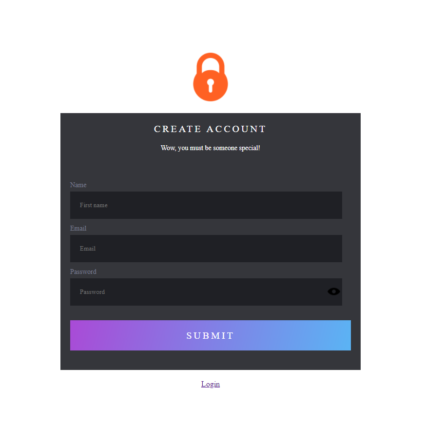

# digivax-ent(React & Flask)

> One paragraph statement about the project.
> 


## Live Demo

[Live Demo Link](https://www.loom.com/share/1c8a44ae51ac41999906b6fe0dfc5aa7)

## Usage

This is a proof of the flask security using flask-security-too package. 

```python
import os

from flask import Flask, render_template_string
from flask_security import Security, current_user, auth_required, hash_password, \
     SQLAlchemySessionUserDatastore
from database import db_session, init_db
from models import User, Role
from flask_wtf.csrf import CSRFProtect
from flask_cors import CORS, cross_origin
from flask_mail import Mail
from flask import json

# Create app
app = Flask(__name__)
app.config['DEBUG'] = True

# Generate a nice key using secrets.token_urlsafe()
app.config['SECRET_KEY'] = os.environ.get("SECRET_KEY", 'F-k5qAt1GKw25b15MJfZFF01YVbDlOjDpmBTBBj5jbU')
# Bcrypt is set as default SECURITY_PASSWORD_HASH, which requires a salt
# Generate a good salt using: secrets.SystemRandom().getrandbits(128)
app.config['SECURITY_PASSWORD_SALT'] = os.environ.get("SECURITY_PASSWORD_SALT", '188932763231738235351165939143117286187')
app.config['SECURITY_FLASH_MESSAGES'] = False
app.config['SECURITY_RECOVERABLE'] = True
app.config['SECURITY_TRACKABLE'] = True
app.config['SECURITY_CHANGEABLE'] = True

# Setup Flask-Security
user_datastore = SQLAlchemySessionUserDatastore(db_session, User, Role)
security = Security(app, user_datastore)
```

## Technologies

- Frontend: React(Hook), Material-UI, Axios, JavaScript, HTML, CSS
- Backend: Flask 2.0.1, Python 3.9.0, [Flask-Security-Too](https://flask-security-too.readthedocs.io/en/stable/index.html), sqlalchemy, sqlite

## Prerequisites

- Install [node](https://nodejs.org/en/download/) and [python](https://www.python.org/downloads/). 
- Install [vscode](https://code.visualstudio.com/download) and [git](https://git-scm.com/downloads)

## Installation

Clone the project to your local machine using 

```bash
git clone https://github.com/coder772/digivax-ent.git
```

There are two folders, including "react-frontend" folder and "flask-backend" folder. 

### 1. Frontend

Go to the "react-frontend" folder and use the package manager [npm](https://docs.npmjs.com/cli/v7) or [yarn](https://classic.yarnpkg.com/en/docs/cli/). 
 
```bash
npm i
```
or 

```bash
npm i yarn
```
```bash
yarn
```

After installing all npm modules, run the frontend project using the following command line. 
```bash
npm start
```
or 

```bash
yarn start
```

You will see the frontend on [http://localhost:3000/]

### 2. Backend

Go to the "flask-backend" folder and use [pip](https://pip.pypa.io/en/stable/) to install foobar.

```python
pip install virtualenv
```
```python
virtualenv venv
```

- Windows
```python
venv\Scripts\activate
```

```python
pip3 install -r requirements.txt
```
Run the backend using the following command line. 
```python
python app.py
```
You will see the backend on [http://127.0.0.1:5000/]

- Ubuntu or Mac
```python
source venv/bin/activate
```

```python
pip3 install -r requirements.txt
```
Run the backend using the following command line. 
```python
python app.py
```

You will see the backend on [http://127.0.0.1:5000/]

## Run tests

Before starting a test, you need to add your mail credential in "flask-backend/config.py"
It only works with your email, because I use a free mail server through mailgun.com. Mailguin requires me to get permission from a recipient before I can send emails.
However, you could test the application yourself by plugging in your gmail credentials and allowing "Unsecure Apps" to access your account from the Google Security panel(gmail.com -> Manage Your Google Account -> Security -> Less Secure App Access -> On).

- config.py
```python
SECRET_KEY = 'F-k5qAt1GKw25b15MJfZFF01YVbDlOjDpmBTBBj5jbU'
SECURITY_PASSWORD_SALT = '188932763231738235351165939143117286187'
MAIL_USERNAME = "your email"
MAIL_PASSWORD = "your email password"
MAIL_SERVER = "smtp.gmail.com"
MAIL_PORT = 465
```

## Authors

👤 **Chris(Senior Frontend Developer)**

- [GitHub](https://github.com/coder772)
- [LinkedIn](https://www.linkedin.com/in/christian-marks-92768b225/)
- [Website](https://chris-m.herokuapp.com/)

## 🤝 Contributing
Pull requests are welcome. For major changes, please open an issue first to discuss what you would like to change.

Please make sure to update tests as appropriate.

## 📝 License
[MIT](https://choosealicense.com/licenses/mit/)
